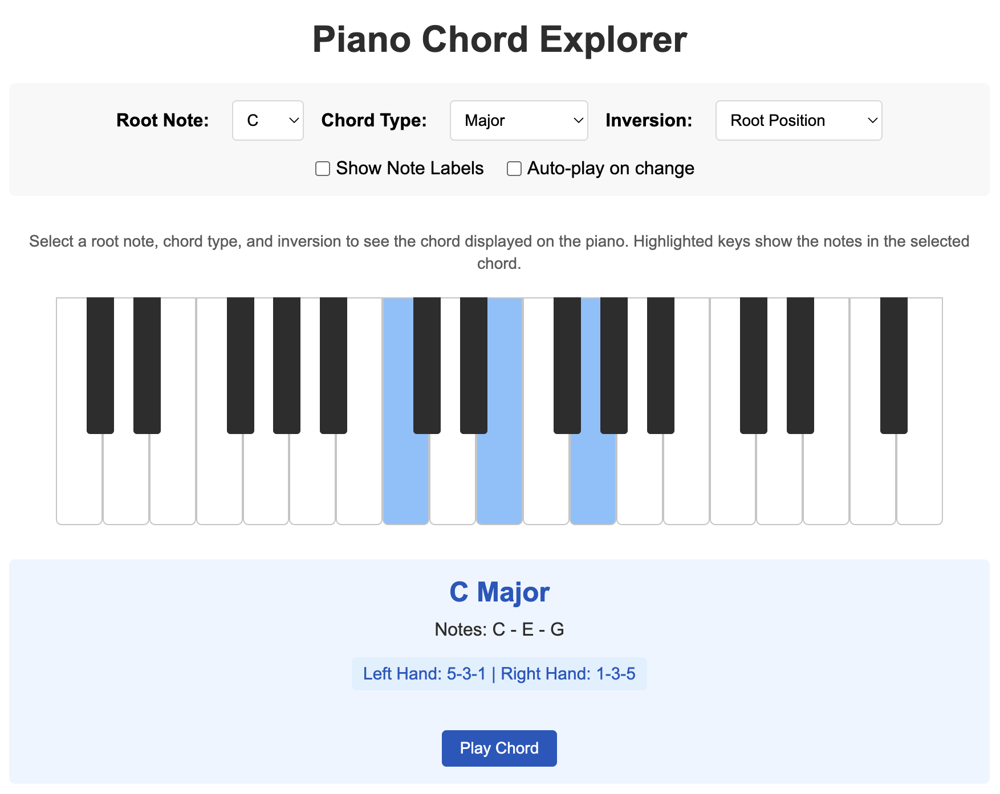

# Piano Chord Explorer

A simple web application that displays piano chords and their inversions with sound playback.
It was built mostly with Claude 3.7 Sonnet and Cursor so expect AI noise and garbage. 
This was put together solely to provide quick visuals for another project I'm working on.
It is a very rough proof of concept and requires significant work to be meaningful, but could be useful on its own.



**GitHub Repository:** [https://github.com/DaveHogan/PianoChordExplorer](https://github.com/DaveHogan/PianoChordExplorer)

**Live Website:** [https://davehogan.co.uk/PianoChordExplorer/](https://davehogan.co.uk/PianoChordExplorer/)

## Project Status

⚠️ **Alpha Version**: This project is in early development stage and is not intended for production use.

Contributions are welcome, but please note that this is primarily a personal project with limited ongoing support. See the [CONTRIBUTING.md](docs/CONTRIBUTING.md) file for more information.

## Features

- Display major, minor, diminished, augmented, and 7th chords
- View chord inversions (root position, first inversion, second inversion, third inversion)
- Interactive piano keyboard visualization
- Select different root notes for chords
- Play chord sounds with Web Audio API
- Auto-play option for hearing chords as you select them
- Play individual notes by clicking on piano keys
- Toggle note labels on/off
- Staff notation display using VexFlow

## Project Structure

```
PianoChordExplorer/
├── src/                    # Source files
│   ├── assets/            # Images and static files
│   ├── css/               # Stylesheets
│   ├── js/                # JavaScript files
│   └── index.html         # Main HTML file
├── docs/                  # Documentation
├── .github/              # GitHub configuration
├── .gitignore            # Git ignore rules
├── LICENSE               # MIT License
├── package.json          # Project configuration
└── README.md             # Project documentation
```

## Development Setup

This project uses a minimal development setup with just one dependency (`serve`) to provide a proper development environment. This ensures:
- Correct MIME types for files
- No CORS issues during development
- Proper URL routing
- Easy testing across different devices

1. Clone the repository:
   ```bash
   git clone https://github.com/DaveHogan/PianoChordExplorer.git
   cd PianoChordExplorer
   ```

2. Install the development server (only needed once):
   ```bash
   npm install
   ```

3. Start the development server:
   ```bash
   npm start
   ```

4. Open your browser and navigate to `http://localhost:3000`

For production, you can simply deploy the contents of the `src` directory to any static file hosting service.

## How to Use

1. Select a root note from the dropdown menu
2. Choose a chord type (Major, Minor, etc.)
3. Select an inversion type if desired
4. The chord will be displayed on the piano keyboard
5. Click "Play Chord" to hear the chord sounds
6. Toggle "Auto-play on change" to automatically hear chords when selections change
7. Click individual piano keys to hear single notes

## Technologies Used

- HTML5
- CSS3
- JavaScript (Vanilla)
- Web Audio API
- VexFlow (for music notation rendering)
- Node.js (for development server)

## Possible Future Improvements

### Enhanced Features
- Add more chord types (9th, 11th, 13th, suspended, etc.)
- Improve sound quality with better synthesis or samples
- Add responsive design for mobile devices
- Save favorite chords
- Display chord notation in music theory format
- Add option to save or export chord progressions

### Technical Improvements
- Replace hardcoded pixel values with CSS variables or percentage-based positioning
- Add keyboard navigation support for accessibility
- Implement full responsive design for different screen sizes
- Add error handling for notes outside the keyboard range
- Provide audio fallback for browsers without Web Audio API support
- Fix black key positioning to be more reliable across different screen sizes
- Improve color contrast for better accessibility
- Implement browser compatibility testing for musical symbols
- Fix event listener handling to prevent memory leaks
- Add touch support optimizations for mobile devices
- Create a proper build system with minification

### Educational Enhancements
- Add chord progression recommendations
- Include voice leading examples between chords
- Provide music theory explanations for each chord type
- Show chord usage examples in popular songs
- Include optional staff notation view

## License

This project is licensed under the MIT License - see the [LICENSE](LICENSE) file for details. 